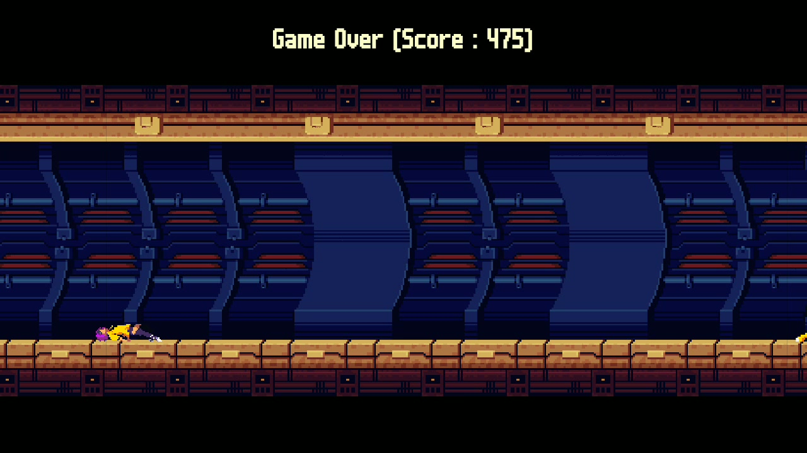

# Grey Silence

[Insert evil overlord]'s turrets have stolen the sound and colour from this endless runner world! Keep collecting gems to bring them back - hit a turret and you'll die though.

## Getting Started

I wasn't able to get round to the audio 😅 But the colour works. Basically the longer you run/the higher you score, the more colour comes back into the world.

A screenshot:

Some gameplay:

## Attributions

Pretty much all assets used are CC-licensed from various sources. Not quite sure how to apply the license here since there are different versions used, will update once I find out

### Fonts

- assets/fonts/retro.tff: Actually named m6x11, a very cool retro font by [David Linssen](https://managore.itch.io/m6x11)

#### Sprites

- assets/images/background.png: built with the Warped Zone 202 asset pack by [ansimuz](https://ansimuz.itch.io/warped-zone-202)
- assets/images/gem.png: trimmed version of the yellow v3 gem in [this pack by Code Inferno Games](https://opengameart.org/content/animated-spinning-gems)
- the rest are all taken from the Warped City asset pack, again by [ansimuz](https://ansimuz.itch.io/warped-city), `assets/images/player-die.png` is a mashup of the jump and back-jump animations and further edited to achieve a death animation. I also added some more frames to the back-jump animation in `assets/images/player-backflip.png` to make a smoother animation
